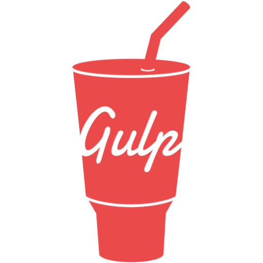

---

 

---
## 📈 𝙸'𝚖 𝚕𝚎𝚊𝚛𝚗 𝙵𝚛𝚘𝚗𝚝-𝚎𝚗𝚍 𝚍𝚎𝚟𝚎𝚕𝚘𝚙𝚖𝚎𝚗𝚝.
  𝙷𝚎𝚕𝚕𝚘 𝚊𝚐𝚊𝚒𝚗, 👋 𝚖𝚢 𝚗𝚊𝚖𝚎 𝚒𝚜 𝙶𝚕𝚎𝚋 𝙼𝚎𝚍𝚟𝚎𝚍𝚎𝚟, 𝙸 𝚊𝚖 𝚜𝚝𝚞𝚍𝚢𝚒𝚗𝚐 𝚝𝚑𝚎 𝚏𝚛𝚘𝚗𝚝𝚎𝚗𝚍, 𝚍𝚘𝚒𝚗𝚐 𝚖𝚢 𝚘𝚠𝚗 𝚜𝚖𝚊𝚕𝚕 𝚙𝚛𝚘𝚓𝚎𝚌𝚝𝚜🗂️. 𝙸 𝚕𝚒𝚔𝚎 𝚝𝚑𝚎 𝚟𝚒𝚜𝚞𝚊𝚕 ✨ 𝚙𝚊𝚛𝚝 𝚘𝚏 𝚝𝚑𝚎 𝚜𝚒𝚝𝚎𝚜, 𝚝𝚑𝚊𝚝'𝚜 𝚠𝚑𝚢 𝙸 𝚛𝚎𝚊𝚕𝚕𝚢 𝚕𝚘𝚟𝚎 𝚌𝚜𝚜 𝚊𝚗𝚍 𝚓𝚜 𝚏𝚘𝚛 𝚝𝚑𝚎 𝚒𝚗𝚝𝚎𝚛𝚊𝚌𝚝𝚒𝚟𝚒𝚝𝚢 𝚊𝚗𝚍 𝚏𝚞𝚗𝚌𝚝𝚒𝚘𝚗𝚊𝚕𝚒𝚝𝚢 ⚙️ 𝚘𝚏 𝚝𝚑𝚎𝚜𝚎 𝚜𝚒𝚝𝚎𝚜, 𝚎𝚟𝚎𝚛𝚢 𝚍𝚊𝚢 𝙸 𝚝𝚛𝚢 𝚝𝚘 𝚕𝚎𝚊𝚛𝚗 𝚜𝚘𝚖𝚎𝚝𝚑𝚒𝚗𝚐 𝚗𝚎𝚠 𝚘𝚛 𝚌𝚘𝚗𝚜𝚘𝚕𝚒𝚍𝚊𝚝𝚎 𝚘𝚕𝚍 𝚔𝚗𝚘𝚠𝚕𝚎𝚍𝚐𝚎.
## 👨🏻‍💻 𝙻𝚊𝚗𝚐𝚞𝚊𝚐𝚎𝚜 𝚊𝚗𝚍 𝚃𝚎𝚌𝚑𝚗𝚘𝚕𝚘𝚐𝚒𝚎𝚜:
  

